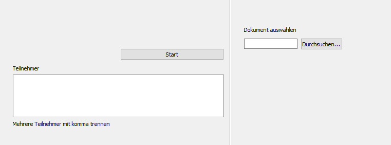

# Py-Generator

## Usage
This is a little script that can generate attendance certificates.

The script scans trough the *.docx file for the "participant" keyword.
This Keyword will be replaced by ne name of the participant given in the UI,
Every participant gets his own file as docx.

1. Select your Template
2. Enter the names, separate them with an "," 
3. Hit "Start"

The output will be saved in the current directory of the Script files

## How it works
Every *.docx file is basically an zip file that contains xml files, these hold the actual data.
So we unpack an cache it.

Now the Script iterates trough the names. For every name a new zip will be generated, this will be renamed to *.docx and...voilà we are done.

## Todo
- Error handling
- English UI
- Export as PDF
- Change output dir